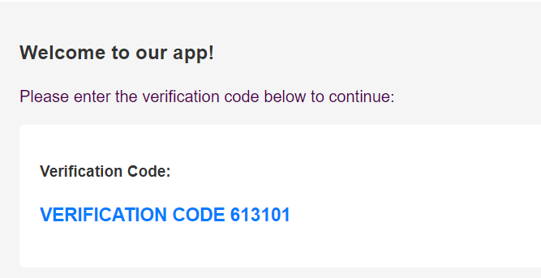

# JetBus App

Bu bir mikroservis mimarisi ile geliştirilmiş uçak bileti satın alma uygulamasıdır. Uygulama back-end projesidir. 
- Kullanıcı kayıt ve giriş işlemleri yapabilir.
- Bilet satın alabilir.

## Kullanılan Teknolojiler

- Java Spring Boot
- Spring Security
- Jwt
- Spring Data Jpa
- Java Mail Sender
- MySQL
- MongoDB
- RabbitMQ
- FeignClient

## Diğer Araçlar

- Git
- Postman
- IntelliJ IDEA

## Bazı Postman Sonuçları

